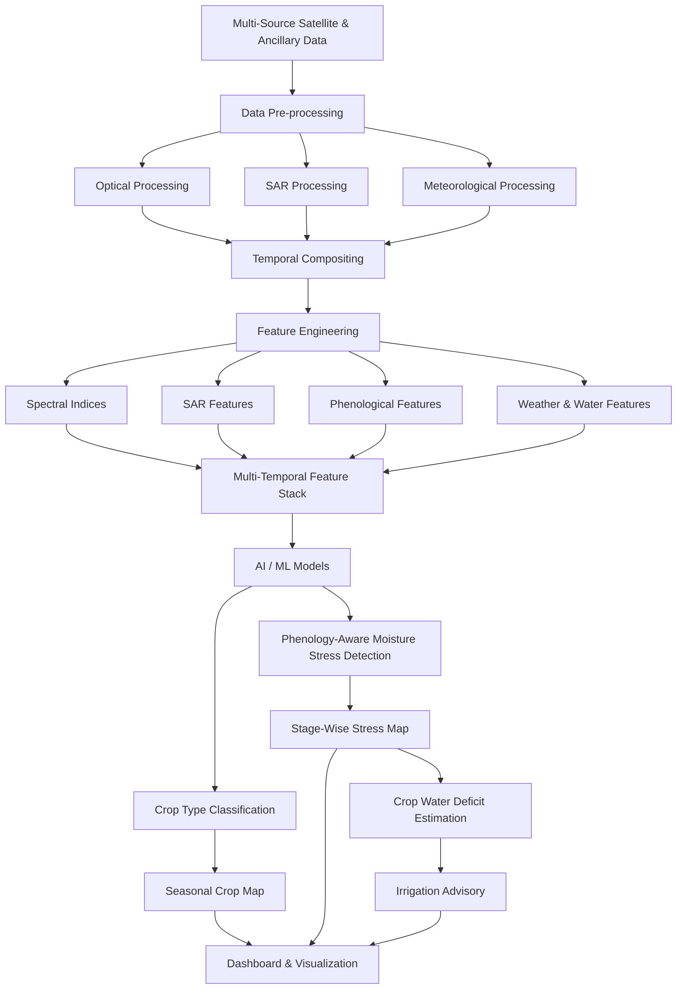

# AgriBit

### AI-Driven Crop Type, Moisture Stress Detection & Irrigation Advisory
### Using Multi-Temporal Optical & Microwave Satellite Data

AgriBit is a satellite-data-driven machine learning system designed to
identify crop types, detect moisture stress across crop growth stages,
and provide irrigation advisories using multi-source Earth observation
data.

The system combines optical, microwave, meteorological, and
evapotranspiration datasets to build a temporal understanding of
agricultural fields.

##  Problem Statement
AI-Driven Automated Crop type, Moisture Stress Detection and irrigation advisory Across Growth Stages Using Moderate Resolution Spectral Signatures (Optical & Microwave Satellite Data)

## Overview
Accurate and timely identification of crop types, detection of moisture stress across phenological stages, and translation of crop water deficit into practical irrigation advisories are critical for:
- Precision agriculture
- Drought monitoring
- Yield forecasting
- Climate-resilient farm management
- Canal command-area water management
- Crop insurance and agricultural monitoring

# Multi-Source Data Fusion
AgriBit is designed around the complementary capabilities of optical, microwave and ancillary datasets.
| Data Source | Primary Use | 
|---|---|---|
Sentinel-2|	Vegetation, spectral signatures and phenology|
Landsat|	Multi-temporal optical observations|
MODIS|	Vegetation dynamics and supporting temporal information|
LISS-III / AWiFS|	Indian Earth observation data|
Sentinel-1|	SAR backscatter and all-weather monitoring|
EOS-05|	Microwave/SAR observations|
Rainfall|	Water availability and stress interpretation|
Reference ET / Weather Data|	Crop water-demand estimation|
Command-Area Boundaries|	Irrigation planning|
Ground Truth|	Training and validation|

Most of these datasets are available through national or international Earth-observation portals, making the proposed architecture suitable for rapid prototyping and future operational scaling.
# Pilot Area
The initial prototype is designed around a defined agricultural command area.

The pilot configuration considers both:
- Irrigated command-area agriculture
- Tail-end / rainfed agricultural regions
This allows the system to investigate differences in crop condition and water stress under varying irrigation availability.
(The study area can later be extended to additional command areas, crop types and growing seasons.)

## Methodology
Follows a multi-stage Earth observation and AI/ML pipeline:

## Data Preprocessing
# Optical Data
Pre-processing may include:
- Atmospheric correction
- Cloud and cloud-shadow masking
- Quality assessment
- Temporal compositing
# SAR Data
Pre-processing may include:
- Speckle filtering
- Refined Lee filtering
- Radiometric processing
- Temporal compositing

## Feature Extraction 
# Vegetation Features
Potential vegetation indices include:
- NDVI
- EVI
- NDWI
- NDMI
- NDRE
- GNDVI
- MSAVI
- VCI
# SAR Features
Potential SAR features include:
- VV polarization
- VH polarization
- VH/VV ratio
- VV/VH ratio
- RVI
- Temporal backscatter anomalies
# Phenological Features
The system can derive growth-stage characteristics such as:
- Sowing
- 
Peak growth
End of Season
Length of Growing Period
Temporal vegetation response